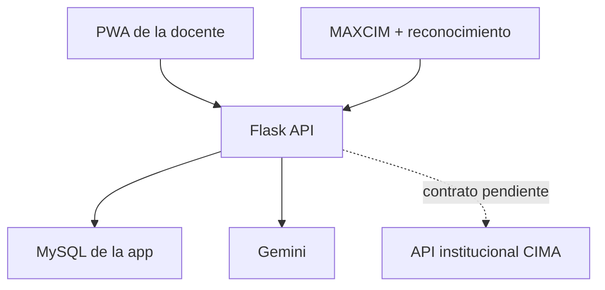

# MAXCIM App

PWA para docentes del Colegio CIMA. Permite preparar cuentos y oraciones con Gemini, revisar preguntas y respuestas esperadas, iniciar una interacción oral con MAXCIM y aprobar la evaluación propuesta por IA.

La alumna o el alumno no usa la aplicación: conversa oralmente con MAXCIM. La web es la consola de la docente y funciona desde iPhone, iPad, Android, Windows y macOS con una sola base de código.

## Flujo implementado

1. La docente sube un documento o crea un cuento con las elecciones del alumno.
2. Gemini extrae o genera el texto, prepara el resumen, crea el audio y propone preguntas con respuestas esperadas.
3. La docente modifica y aprueba el contenido antes de guardarlo.
4. La docente prepara una sesión indicando aula, material y objetivo.
5. El sistema facial institucional envía el ID reconocido. La app no guarda fotos ni plantillas biométricas.
6. MAXCIM registra cada turno oral y la calificación objetiva de las respuestas.
7. La app calcula participación y comprensión; Gemini propone indicadores de interacción oral usando solo la evidencia de la transcripción.
8. La docente corrige los porcentajes, agrega observaciones y aprueba el resultado final.



## Inicio local

Requisitos: Python 3.11+, MySQL 8 y una clave de Gemini.

```bash
python -m venv .venv
source .venv/bin/activate
pip install -r requirements-dev.txt
cp .env.example .env
```

En Windows PowerShell, la activación es `.venv\Scripts\Activate.ps1`.

Crear las tablas:

```bash
mysql -u root -p < bd_app.sql
mysql -u root -p test < migrations/001_interacciones.sql
```

Configurar `.env` y ejecutar:

```bash
python app.py
```

Abrir `http://localhost:5000`. Para probar sin la API institucional, `DEMO_MODE=true` habilita los botones de simulación. Nunca debe activarse en producción.

## Variables principales

| Variable | Uso |
|---|---|
| `GOOGLE_API_KEY` | Generación, resumen, preguntas, evaluación y TTS con Gemini |
| `MYSQL_*` | Conexión MySQL de la aplicación |
| `MAXCIM_WEBHOOK_SECRET` | Autentica eventos enviados por MAXCIM y el servicio facial |
| `FACE_MATCH_MIN_CONFIDENCE` | Umbral para aceptar una coincidencia facial; por defecto `0.85` |
| `DEMO_MODE` | Activa datos y acciones de simulación locales |
| `SESSION_COOKIE_SECURE` | Debe ser `true` cuando el sitio use HTTPS |

## Endpoints para MAXCIM

Las llamadas del robot usan el encabezado `X-MAXCIM-Webhook-Secret`.

| Método y ruta | Finalidad |
|---|---|
| `POST /api/integrations/face-recognition/events` | Asociar el ID institucional reconocido a una sesión |
| `GET /api/interactions/sessions/{uuid}/robot-payload` | Obtener objetivo, material y preguntas aprobadas |
| `POST /api/interactions/sessions/{uuid}/turns` | Registrar un turno oral de MAXCIM o del alumno |
| `POST /api/interactions/sessions/{uuid}/complete` | Cerrar la sesión y crear la evaluación revisable |

El contrato completo y los ejemplos JSON están en [docs/integration-contract.md](docs/integration-contract.md).

## Base de datos y privacidad

La base institucional sigue siendo la fuente de verdad para docentes, alumnos, aulas y reconocimiento facial. Esta aplicación almacena sus IDs canónicos, materiales, transcripciones, métricas y revisiones; no replica fotos, embeddings faciales ni contraseñas institucionales.

Las tablas nuevas se encuentran en `migrations/001_interacciones.sql`:

- `pregunta`
- `sesion_interaccion`
- `turno_conversacion`
- `evaluacion_interaccion`
- `evento_reconocimiento`

El service worker nunca guarda en caché `/api/*` ni `/static/uploads/*`.

## Pruebas

```bash
pytest -q
```

Las pruebas cubren identificación facial con umbral, rechazo de personal no alumno, material y preguntas autorizadas, turnos orales, cálculo de porcentajes, revisión docente, secreto del robot y recursos PWA.

## Integración institucional pendiente

No se inventó el formato de la API principal. Para reemplazar el usuario y las aulas de demostración hacen falta la URL base, el método de autenticación, los JSON de respuesta y la regla oficial para validar que el alumno reconocido pertenece al aula seleccionada. La lista exacta está documentada en el contrato de integración.
