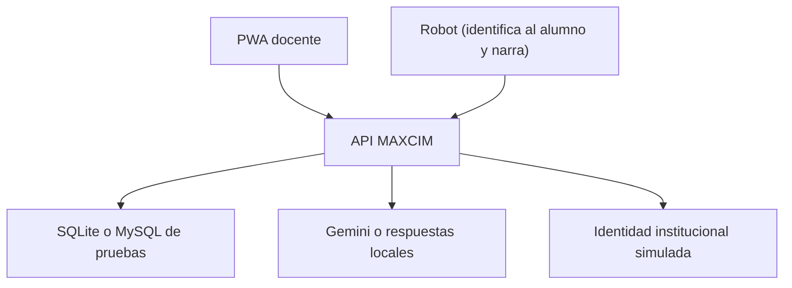

# MAXCIM App · Entorno de pruebas

Aplicación web instalable y aislada para probar la experiencia completa de MAXCIM sin conectarse a la base institucional. Conserva la misma interfaz y flujo de la versión real, pero utiliza docentes, aulas, alumnos y respuestas de IA exclusivos de prueba cuando los servicios externos no están configurados.

La versión real permanece separada en `maxcim_app_production`: este repositorio no debe conectarse a su base de datos ni compartir sus variables privadas.

La estudiante o el estudiante conversa oralmente con MAXCIM. La docente utiliza esta consola desde iPhone, iPad, Android, Windows o macOS.

## Capacidades conservadas

1. La docente entra con un clic o con cualquier ID y credencial no vacíos de prueba.
2. La aplicación carga aulas ficticias, claramente aisladas del colegio.
3. La docente sube un documento o crea un cuento con las elecciones del alumno y elige una duración de 1 a 15 minutos.
4. Gemini ajusta la extensión, narra el cuento completo con ritmo adaptativo, genera el resumen y propone preguntas con respuestas esperadas.
5. La docente edita y aprueba el contenido antes de guardarlo.
6. El robot ya resuelve por su cuenta qué alumno tiene enfrente y qué material está usando; reporta cada turno de pregunta/respuesta a MAXCIM con una sola llamada (`POST /api/interacciones`), sin que MAXCIM gestione sesiones ni haga reconocimiento facial.

El seguimiento docente se consulta por aula en `/aulas/<id>/avance`; allí las interacciones se cruzan con la matrícula vigente informada por la API institucional.



## Separación del entorno real

- `DEMO_MODE=true` está activado por defecto solamente en este repositorio.
- Sin Google o API institucional, el acceso de prueba sigue habilitado.
- Sin clave de Gemini, se generan cuentos, preguntas y audio WAV locales de prueba.
- Al configurar `GOOGLE_API_KEY`, las funciones generativas utilizan Gemini manteniendo la identidad institucional simulada.
- La contraseña institucional no se almacena.
- No hay tabla de sesiones en el servidor: la sesión de la docente vive solo en la cookie firmada de Flask, y el token institucional va cifrado dentro de esa misma cookie (nunca en texto plano).
- No se almacenan fotografías, embeddings ni plantillas biométricas — MAXCIM no hace reconocimiento facial.
- El simulador puede llamar los endpoints del robot sin secreto únicamente mientras `DEMO_MODE=true`.
- Los materiales se filtran por el ID de la docente autenticada; las interacciones, por el material y/o el alumno.

## Preparación local

Requisito mínimo: Python 3.11+. SQLite, el acceso local y las respuestas simuladas funcionan sin configurar otros servicios.

```bash
python -m venv .venv
source .venv/bin/activate
pip install -r requirements-dev.txt
cp .env.example .env
```

En Windows PowerShell, la activación es `.venv\Scripts\Activate.ps1`.

Ejecutar:

```bash
python app.py
```

## Despliegue del entorno de pruebas

GitHub Pages no puede ejecutar esta aplicación porque solo publica sitios
estáticos y MAXCIM utiliza Python, MySQL y APIs del servidor. El repositorio
incluye un `Dockerfile` listo para desplegarse como servicio web en Railway:

1. Crear otro servicio de Railway desde este repositorio, separado de producción.
2. Mantener `DEMO_MODE=true`. Sin `DATABASE_URL` utilizará SQLite automáticamente.
3. Para conservar los datos entre despliegues, agregar MySQL y definir `DATABASE_URL=${{MySQL.MYSQL_URL}}`.
4. Generar el dominio público desde `Settings > Networking`.
5. Para conservar audios entre despliegues, montar un volumen persistente en
   `/app/static/uploads`.

El contenedor crea las tablas faltantes de una base nueva antes de iniciar
Gunicorn y publica `GET /health` para comprobar el estado del servicio. Si la API
institucional solo existe dentro de la red del colegio, será necesario exponerla
de forma segura por HTTPS o conectar el alojamiento a esa red privada.

La fecha de carga de cada material se asigna desde la aplicación para mantener
compatibilidad con las versiones administradas de MySQL usadas en producción.

## Variables del entorno de pruebas

| Variable | Uso |
|---|---|
| `DEMO_MODE` | Debe permanecer `true` en este repositorio |
| `DEMO_DATABASE_URL` | SQLite local usado cuando no existe `DATABASE_URL` |
| `DATABASE_URL` | Base MySQL opcional y persistente del entorno de pruebas |
| `MYSQL_*` | Compatibilidad cuando `DEMO_MODE=false`; no reemplazan SQLite en pruebas |
| `GOOGLE_API_KEY` | Opcional; activa Gemini real para cuentos, preguntas y TTS |

Las variables institucionales, Google OAuth y secretos del robot no son necesarias para recorrer la prueba. No copies aquí credenciales privadas de producción.

## Variables de compatibilidad con producción

| Variable | Uso |
|---|---|
| `SECRET_KEY` | Firma la cookie de sesión de la docente |
| `SESSION_TOKEN_ENCRYPTION_KEY` | Cifra el token institucional dentro de esa cookie |
| `INSTITUTIONAL_API_BASE_URL` | URL autorizada de la API principal |
| `INSTITUTIONAL_API_LOGIN_PATH` | Inicio de sesión docente |
| `INSTITUTIONAL_API_GOOGLE_LOGIN_PATH` | Canje del ID token de Google por una sesión institucional |
| `INSTITUTIONAL_API_CLASSROOMS_PATH` | Aulas de la docente autenticada |
| `INSTITUTIONAL_API_STUDENT_PATH` | Perfil y matrículas del ID reconocido (reservado para uso futuro) |
| `INSTITUTIONAL_API_SERVICE_TOKEN` | Credencial servidor-a-servidor hacia la API institucional |
| `GOOGLE_OAUTH_CLIENT_ID` | Cliente web OpenID Connect de Google Workspace |
| `GOOGLE_OAUTH_CLIENT_SECRET` | Secreto del cliente web, solo en el servidor |
| `GOOGLE_OAUTH_ALLOWED_DOMAINS` | Dominios Workspace institucionales permitidos |
| `GOOGLE_OAUTH_REDIRECT_URI` | Callback HTTPS registrado exactamente en Google Cloud |
| `MAXCIM_WEBHOOK_SECRET` | Autentica al robot frente a los endpoints de `/api/materials` y `/api/interacciones` |
| `SESSION_COOKIE_SECURE` | Debe permanecer `true` bajo HTTPS |

## Endpoints del robot

| Método y ruta | Finalidad |
|---|---|
| `GET /api/materials?teacher_id={id}` | Listar materiales de una docente |
| `GET /api/materials/{id}` | Obtener un material (URLs de audio/texto y sus preguntas) |
| `POST /api/interacciones` | Registrar un turno de pregunta/respuesta ya resuelto por el robot |
| `GET /api/interacciones?id_material={id}&fk_alumno={id}` | Consultar el historial de interacciones |

Todas las rutas requieren el header `X-MAXCIM-Webhook-Secret` con el valor de `MAXCIM_WEBHOOK_SECRET` (se omite mientras `DEMO_MODE=true`). El robot identifica al alumno y elige el material por su cuenta — MAXCIM ya no hace reconocimiento facial ni gestiona sesiones de interacción.

> [docs/integration-contract.md](docs/integration-contract.md) todavía describe el contrato anterior (sesiones, turnos, reconocimiento facial) y está pendiente de actualizar a este esquema.

## Base de datos

La base aislada de este entorno guarda solamente dos tablas — ver [bd_app.sql](bd_app.sql) para el DDL completo:

- **`material`**: título, tipo, rutas de texto/audio/preguntas generadas y el ID institucional de la docente dueña (`fk_user`).
- **`interaccion`**: un registro por cada turno de pregunta/respuesta entre un alumno y MAXCIM sobre un material (`id_material`, `fk_alumno`, pregunta, respuesta, audio de la respuesta, apreciación del robot y si fue correcta).

No se guardan sesiones, evaluaciones agregadas ni eventos de reconocimiento facial. Docentes y alumnos nunca se replican localmente: su identidad siempre se resuelve contra la API institucional.

## Pruebas

```bash
pytest -q
```

Las pruebas automatizadas usan dobles aislados dentro del entorno de test. Esos datos nunca se cargan en la aplicación ni en la base de producción.

## Estado

Este repositorio está preparado para recorridos funcionales y pruebas con docentes. Los resultados generados sin servicios externos son ficticios y permanecen dentro de este entorno. La conexión final a identidades, aulas y Gemini se mantiene en el repositorio de producción.
