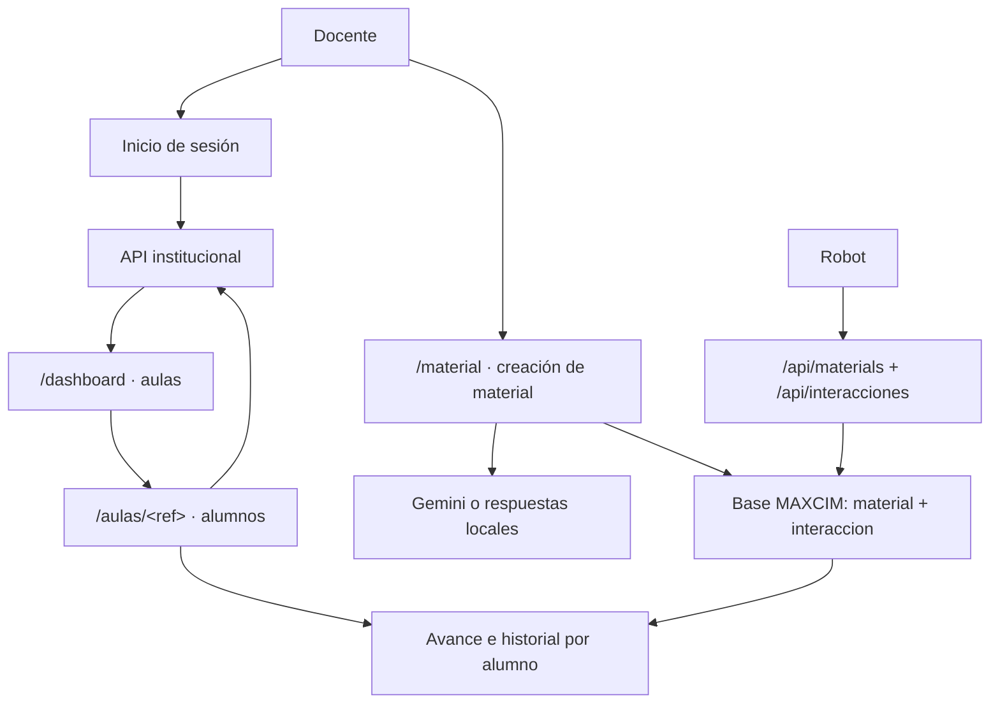

# MAXCIM App · Entorno de pruebas

Aplicación web instalable y aislada para probar la experiencia actual de MAXCIM sin conectarse a la base institucional. Conserva la interfaz y el flujo del producto, pero cuando los servicios externos no están configurados utiliza docentes, aulas, alumnos y respuestas de IA exclusivos de prueba.

La versión real permanece separada en `maxcim_app_production`: este repositorio no debe conectarse a su base de datos ni compartir sus variables privadas.

La estudiante o el estudiante conversa oralmente con MAXCIM. La docente utiliza esta consola desde iPhone, iPad, Android, Windows o macOS para preparar material y revisar el avance de sus aulas.

## Flujo actual de la docente

1. La docente inicia sesión con sus credenciales institucionales o mediante el canje de Google. En producción, la identidad siempre se valida con la API institucional.
2. `/dashboard` consulta y muestra las aulas asignadas a la docente.
3. `/aulas/<ref>` consulta la matrícula vigente y muestra sus alumnos en una tabla.
4. `/material` permite crear y revisar el material que utilizará el robot.
5. El robot consulta los materiales, identifica por su cuenta al alumno y registra cada interacción de pregunta y respuesta.
6. `/aulas/<ref>/avance` cruza la matrícula institucional con las interacciones de los materiales de la docente y muestra un acierto o error por interacción, además del total correcto/realizado.
7. `/aulas/alumno/<ref>` muestra el historial completo del alumno: pregunta, respuesta, apreciación del robot y resultado.

`<ref>` es un token firmado con `SECRET_KEY` que lleva dentro el tipo (`aula`/`alumno`), el ID institucional y el `id` de la docente. El ID no viaja en texto plano en la ruta, el token no se puede falsificar ni reutilizar en la sesión de otra docente, caduca a las 24 h y rotar `SECRET_KEY` invalida todos. Un `<ref>` alterado, caducado, de otra docente o del tipo equivocado responde `404`. Los archivos de los materiales y los audios de respuesta se sirven a la consola por `/media/<token>` (URL firmada, atada al `id` de la docente, caduca en 1 h), nunca desde `/static/`.

MAXCIM no gestiona sesiones de interacción ni realiza reconocimiento facial. La antigua ruta `/sesiones` fue eliminada.



## Tipos de material

`material.tipo_material` admite exactamente dos valores:

- **`cuento`**: guarda rutas de archivos en `path_texto`, `path_texto_resumen`, `path_audio`, `path_audio_resumen` y `path_preguntas`. Esta última apunta al JSON de preguntas aprobadas por la docente.
- **`oracion`**: guarda las oraciones como texto plano completo en `path_preguntas`. Deja `path_texto`, `path_texto_resumen`, `path_audio` y `path_audio_resumen` en `NULL`.

## Separación del entorno real

- `DEMO_MODE=true` está activado por defecto solamente en este repositorio.
- Sin Google o API institucional, el acceso, las aulas y los alumnos de prueba siguen habilitados.
- Sin clave de Gemini, se generan cuentos, preguntas y audio WAV locales de prueba.
- Al configurar `GOOGLE_API_KEY`, las funciones generativas utilizan Gemini manteniendo la identidad institucional simulada.
- La contraseña institucional no se almacena.
- No hay tabla de sesiones en el servidor: la sesión de la docente vive solo en la cookie firmada de Flask, y el token institucional va cifrado dentro de esa misma cookie, nunca en texto plano.
- No se almacenan fotografías, embeddings ni plantillas biométricas.
- El simulador puede llamar los endpoints del robot sin secreto únicamente mientras `DEMO_MODE=true`.
- Los materiales se filtran por el ID institucional de la docente; las interacciones, por material y/o alumno.

## Preparación local

Requisito mínimo: Python 3.11+. SQLite, el acceso local y las respuestas simuladas funcionan sin configurar otros servicios.

```bash
python -m venv .venv
source .venv/bin/activate
pip install -r requirements-dev.txt
cp .env.example .env
```

En Windows PowerShell, la activación es `.venv\Scripts\Activate.ps1`.

Ejecutar:

```bash
python app.py
```

## Despliegue del entorno de pruebas

GitHub Pages no puede ejecutar esta aplicación porque solo publica sitios
estáticos y MAXCIM utiliza Python, MySQL y APIs del servidor. El repositorio
incluye un `Dockerfile` listo para desplegarse como servicio web en Railway:

1. Crear otro servicio de Railway desde este repositorio, separado de producción.
2. Mantener `DEMO_MODE=true`. Sin `DATABASE_URL` utilizará SQLite automáticamente.
3. Para conservar los datos entre despliegues, agregar MySQL y definir `DATABASE_URL=${{MySQL.MYSQL_URL}}`.
4. Generar el dominio público desde `Settings > Networking`.
5. Para conservar audios entre despliegues, montar un volumen persistente en `/app/instance/uploads` (o la ruta que indique `MAXCIM_UPLOADS_DIR`). Estos archivos ya no viven bajo `static/`: se sirven solo con autenticación, por `/media/<token>` (consola) o `/api/materials/<id>/<recurso>` (robot).

El contenedor crea las tablas faltantes de una base nueva antes de iniciar Gunicorn y publica `GET /health` para comprobar el estado del servicio. Si la API institucional solo existe dentro de la red del colegio, será necesario exponerla de forma segura por HTTPS o conectar el alojamiento a esa red privada.

La fecha de carga de cada material se asigna desde la aplicación para mantener compatibilidad con las versiones administradas de MySQL usadas en producción.

## Variables del entorno de pruebas

| Variable | Uso |
|---|---|
| `DEMO_MODE` | Debe permanecer `true` en este repositorio |
| `DEMO_DATABASE_URL` | SQLite local usado cuando no existe `DATABASE_URL` |
| `DATABASE_URL` | Base MySQL opcional y persistente del entorno de pruebas |
| `MYSQL_*` | Compatibilidad cuando `DEMO_MODE=false`; no reemplazan SQLite en pruebas |
| `GOOGLE_API_KEY` | Opcional; activa Gemini real para cuentos, preguntas y TTS |

Las variables institucionales, Google OAuth y secretos del robot no son necesarias para recorrer la prueba. No copies aquí credenciales privadas de producción.

## Variables de compatibilidad con producción

| Variable | Uso |
|---|---|
| `SECRET_KEY` | Firma la cookie de sesión de la docente |
| `SESSION_TOKEN_ENCRYPTION_KEY` | Cifra el token institucional dentro de esa cookie |
| `INSTITUTIONAL_API_BASE_URL` | URL autorizada de la API principal |
| `INSTITUTIONAL_API_LOGIN_PATH` | Inicio de sesión docente |
| `INSTITUTIONAL_API_GOOGLE_LOGIN_PATH` | Canje del ID token de Google por una sesión institucional |
| `INSTITUTIONAL_API_CLASSROOMS_PATH` | Aulas de la docente autenticada; admite `{teacher_id}` |
| `INSTITUTIONAL_API_STUDENTS_PATH` | Alumnos matriculados en un aula; admite `{classroom_id}` |
| `GOOGLE_OAUTH_CLIENT_ID` | Cliente web OpenID Connect de Google Workspace |
| `GOOGLE_OAUTH_CLIENT_SECRET` | Secreto del cliente web, solo en el servidor |
| `GOOGLE_OAUTH_ALLOWED_DOMAINS` | Dominios Workspace institucionales permitidos |
| `GOOGLE_OAUTH_REDIRECT_URI` | Callback HTTPS registrado exactamente en Google Cloud |
| `MAXCIM_WEBHOOK_SECRET` | Autentica al robot frente a `/api/materials` y `/api/interacciones` |
| `SESSION_COOKIE_SECURE` | Debe permanecer `true` bajo HTTPS |

## Rutas de la consola docente

| Método y ruta | Finalidad |
|---|---|
| `GET /dashboard` | Listar las aulas de la docente autenticada |
| `GET /aulas/<ref>` | Listar los alumnos del aula (`<ref>` = token firmado, por tipo, atado a la docente, caduca 24 h) |
| `GET /aulas/<ref>/avance` | Mostrar aciertos, errores y total por alumno |
| `GET /aulas/alumno/<ref>` | Mostrar todas las interacciones del alumno |
| `GET /media/<token>` | Servir un archivo de material a la consola (URL firmada, caduca en 1 h) |
| `GET /material` | Consultar y crear material de tipo `cuento` u `oracion` |

No existe `/sesiones`. Las vistas de avance e historial sí tienen backend: combinan la matrícula que devuelve la API institucional con `material` e `interaccion` en la base propia de MAXCIM.

## Endpoints del robot

| Método y ruta | Finalidad |
|---|---|
| `GET /api/materials?teacher_id={id}` | Listar materiales de una docente |
| `GET /api/materials/{id}` | Obtener un cuento con sus recursos y preguntas, o el texto de una oración |
| `POST /api/interacciones` | Registrar un turno de pregunta/respuesta ya resuelto por el robot (`multipart/form-data`: sube el audio de la respuesta como `audio_rpta`) |
| `GET /api/interacciones/{id}/audio` | Descargar el audio de la respuesta subido al registrar la interacción |
| `GET /api/interacciones?id_material={id}&fk_alumno={id}` | Consultar el historial de interacciones |

Todas las rutas requieren el header `X-MAXCIM-Webhook-Secret` con el valor de `MAXCIM_WEBHOOK_SECRET`. La validación se omite mientras `DEMO_MODE=true`.

El contrato completo de solicitudes, respuestas y variantes provisionales de la API institucional está en [docs/integration-contract.md](docs/integration-contract.md).

## Base de datos

La base aislada guarda solamente dos tablas — ver [bd_app.sql](bd_app.sql) para el DDL completo:

- **`material`**: material de tipo `cuento` u `oracion` y el ID institucional de la docente dueña (`fk_user`).
- **`interaccion`**: un registro por cada turno entre un alumno y MAXCIM (`id_material`, `fk_alumno`, pregunta, respuesta, audio de la respuesta, apreciación del robot y si fue correcta).

Docentes, aulas y alumnos siempre provienen de la API institucional y nunca se persisten localmente. Tampoco se guardan sesiones, evaluaciones agregadas ni eventos de reconocimiento facial.

Como `interaccion` no tiene una columna de aula, el avance de un aula se deriva intersectando su matrícula vigente con las interacciones asociadas a los materiales de la docente autenticada.

## Pruebas

```bash
venv/Scripts/python.exe -m pytest -q
```

Las pruebas automatizadas usan dobles aislados dentro del entorno de test. Esos datos nunca se cargan en la aplicación ni en la base de producción.

## Estado

Este repositorio está preparado para recorridos funcionales y pruebas con docentes. Los resultados generados sin servicios externos son ficticios y permanecen dentro de este entorno. Antes de conectar producción se debe confirmar con la persona responsable de la API institucional el contrato definitivo de alumnos por aula.
